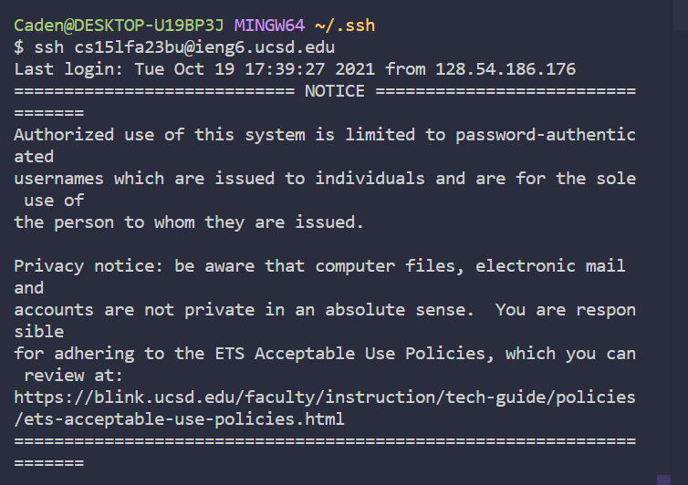

# CSE15L Lab 2

**Part 1** <br>

Code for StringServer: <br>
```
import java.io.IOException;
import java.net.URI;

class Handler implements URLHandler {
    // The one bit of state on the server: a number that will be manipulated by
    // various requests.
    String[] arr = new String[2];
    int size;
    
    public void expandCapacity(){
        int currentCapacity = arr.length;
        if(size < currentCapacity){
            return;
        }
        else{
            String [] expanded = new String[currentCapacity*2];
            for(int i = 0; i < this.size; i++){
                expanded[i] = this.arr[i];
            }
            arr = expanded;
        }
    }
    public String format(String[] arr){
        StringBuilder builder = new StringBuilder();
        for(int i = 0; i < size; i++){
            builder.append(arr[i]).append(System.lineSeparator());
        }
        return builder.toString();
    }

    public String handleRequest(URI url) {
        if (url.getPath().equals("/")) {
            return format(arr);
        }
        else if(url.getPath().equals("/add-message")){
            
                String[] newWord = url.getQuery().split("=");
                String toAdd = String.format("%d. %s", size+1, newWord[1]);
                expandCapacity();
                arr[size] = toAdd;
                size++;

                return "String added!";
                
                

        }
         else {
            
            return "404 Not Found!";
        }
    }
}

class StringServer {
    public static void main(String[] args) throws IOException {
        if(args.length == 0){
            System.out.println("Missing port number! Try any number between 1024 to 49151");
            return;
        }

        int port = Integer.parseInt(args[0]);

        Server.start(port, new Handler());
    }
}
```
ScreenShot 1 of addMessage Method: <br>
 <br>
The handleRequest Method is called when the addMessage is included in the path. Specifically, if the value of url.getPath(), which is another method, is equal to /add-message, will the code try to add the message. If the if loop begins, the getQuery() method would then split the query, which is the input after ? in the url, will create a new String array called newWord that includes the string after '='. Then, that string is formated with a number in front, such as 1., this number depends on the index of the current last element in the arr array, which the server would print out if no path is added. If the array arr is too small, the method expend capacity is called to expand the array. <br>

ScreenShot 2 of addMessage Method: <br>
 <br>
The handleRequest Method is called when the addMessage is included in the path. Specifically, if the value of url.getPath(), which is another method, is equal to /add-message, will the code try to add the message. If the if loop begins, the getQuery() method would then split the query, which is the input after ? in the url, will create a new String array called newWord that includes the string after '='. Then, that string is formated with a number in front, such as 1., this number depends on the index of the current last element in the arr array, which the server would print out if no path is added. If the array arr is too small, the method expend capacity is called to expand the array. <br>

ScreenShot of end result printed in LocalHost: <br>
 <br>


**Part 2** <br>

Path to Private Key: <br>
 <br>

Path to Public Key: <br>
 <br>

Login without password: <br>
 <br>

**Part 3** <br>

In the labs of week 2 and week 3, I learned a lot about url, such as the path and query, as well as how a simple search engine or number incrementer functions. I also learned how to log on to a remote machine like the ieng6, as well as how to create files in those servers.
